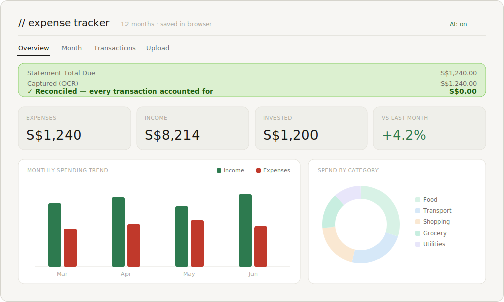

# 💸 Expense Tracker — Singapore Bank Statements

A private, single-file expense tracker that turns your Singapore bank statement
PDFs into a categorised spending dashboard — **entirely in your browser**. No
server, no sign-up, no data ever leaves your device.

👉 **Try it live:** https://kriti0111.github.io/sg-expense-tracker/

> _Preview uses sample data. Your real statements are parsed and stored only in your own browser._

## What it does

- Drop in a **PDF statement** and it extracts, categorises, and charts your
  transactions.
- **Supported formats:** HSBC Visa Revolution, DBS Consolidated Statement,
  Citibank, and Trust Bank credit-card statements.
- **Multi-month view:** a sidebar of your recent months, spending trends, a
  per-month drill-down (donut + category breakdown), and an editable
  transactions list.
- **OCR fallback:** some statements (e.g. HSBC's newer format) are exported as
  images with no selectable text. The app detects this and reads them with
  in-browser OCR (Tesseract.js) — no upload, no cost.
- **Reconciliation check:** every statement's captured total is compared against
  its declared "Total Due". A green banner means it reconciles exactly; an amber
  one shows the precise gap and lets you add the missing row before saving.

## How it works

1. **Read the PDF in the browser.** `pdf.js` pulls the text out of your statement
   locally — nothing is uploaded. If a statement has no text layer (some banks now
   export flattened image-PDFs), the app automatically falls back to **on-device
   OCR** (Tesseract.js) and reads it optically.
2. **Parse & categorise.** Bank-specific parsers turn the raw text into structured
   transactions and assign each a category from keyword rules. Anything unusual can
   optionally be classified by **Gemini** — but only the merchant name is sent, and
   only if you supply your own free key.
3. **Reconcile before you trust it.** The app sums what it captured and compares it
   to the statement's declared total. **Green = it matches to the cent**, so you can
   trust it without eyeballing every row. **Amber** shows the exact gap and lets you
   add or fix a row until it turns green — a guarantee you never save a wrong total.
4. **Store & visualise locally.** Everything is saved in your browser (IndexedDB)
   and rendered with Chart.js — monthly trends, per-category breakdowns, and an
   editable, chronological transaction list for easy cross-checking.

## Privacy

Everything runs client-side. Your statements are parsed **in your own browser**
and stored locally (IndexedDB). Nothing is uploaded anywhere. The only optional
external call is to Google's Gemini API for categorising unusual merchants — and
only if **you** add your own free API key; even then, just the merchant name is
sent, never amounts or your statement.

## How to use

1. Open the [live link](https://kriti0111.github.io/sg-expense-tracker/) (or
   download `index.html` + `parsers.js` into one folder and open `index.html` in
   Chrome).
2. Go to **Upload**, drop in your statement PDF, and click **Parse**.
3. Review the transactions (check the reconciliation banner), then **Save**.
4. Explore the **Overview**, **Month**, and **Transactions** tabs.

## Notes & limitations

- Built and tested against **specific Singapore bank statement layouts**. Other
  banks/cards won't parse without adding a new parser — contributions welcome.
- Works best in **Chrome/Edge** (uses IndexedDB + pdf.js).
- OCR'd statements can occasionally miss a row; the reconciliation banner always
  tells you when the total doesn't match so you can add it.
- This is a personal-use tool, provided as-is with no warranty. Always verify
  against your official statement.

## Tech

Vanilla HTML/JS/CSS — no framework, no build step. Libraries load from CDN at
runtime: [pdf.js](https://mozilla.github.io/pdf.js/),
[Chart.js](https://www.chartjs.org/), and
[Tesseract.js](https://tesseract.projectnaptha.com/).

## License

Licensed under [CC BY-NC 4.0](https://creativecommons.org/licenses/by-nc/4.0/) —
free to use, modify, and share for **non-commercial** purposes, with attribution.
**Commercial use (including selling) is not permitted.**
